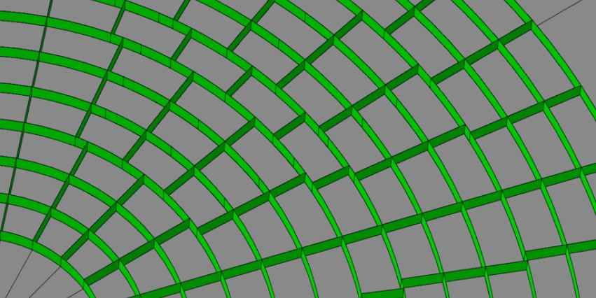
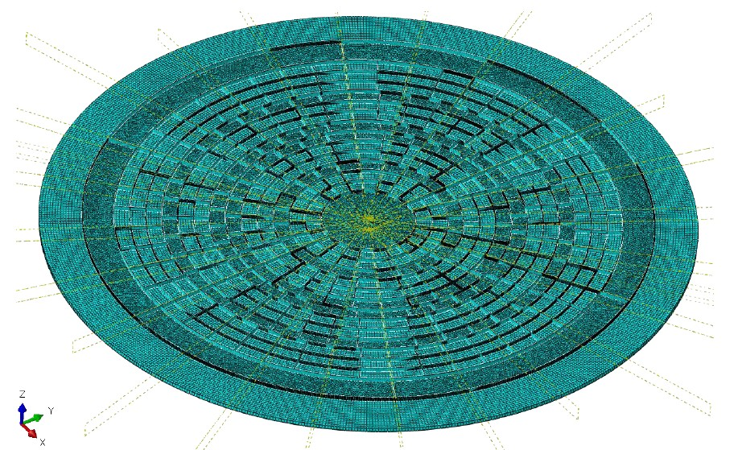
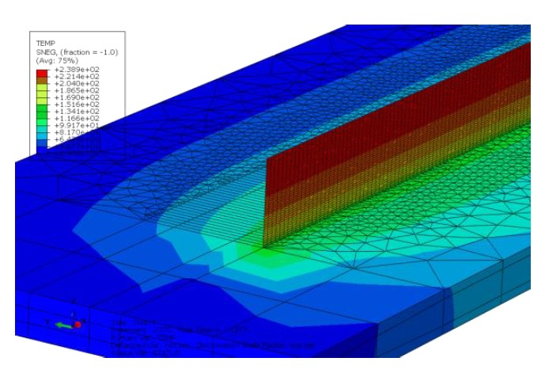
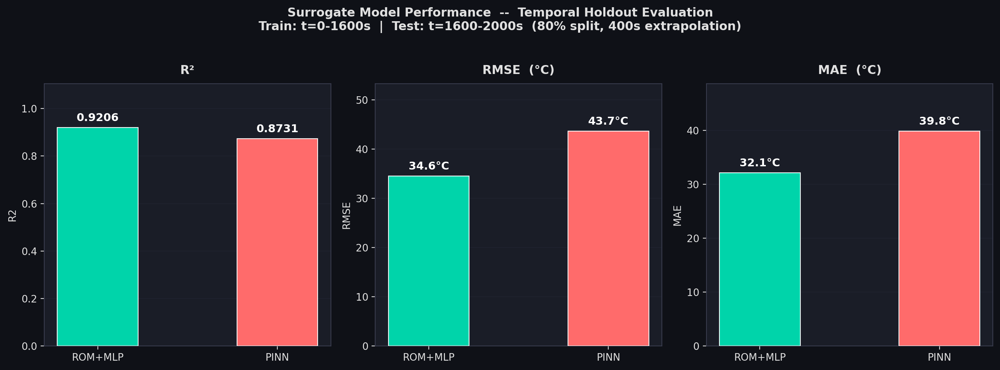
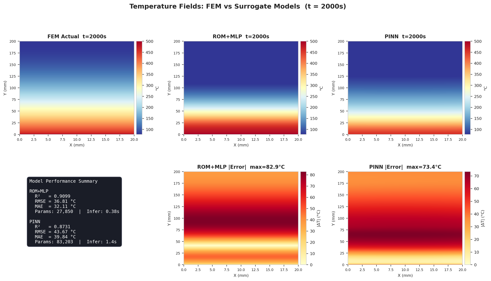
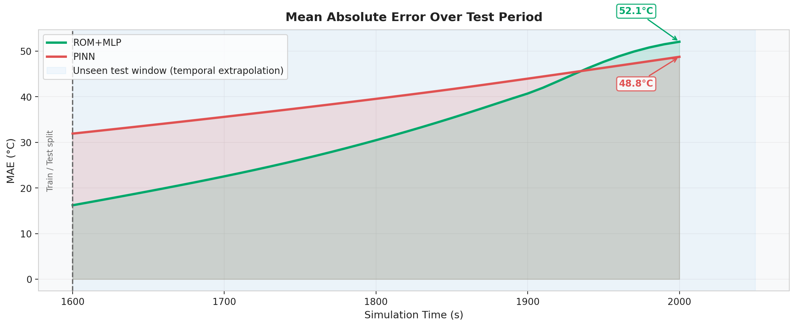
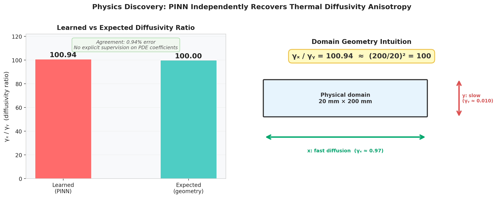

# Thermal Surrogate Models for DED Additive Manufacturing Simulation


---

## Motivation: The ATHENA Space Telescope

<table>
<tr>
<td width="50%" valign="top">

**[ATHENA](https://sci.esa.int/web/athena)** (Advanced Telescope for High-ENergy Astrophysics) is ESA's next-generation X-ray space observatory, targeted for launch in the early 2030s. Its mission: probe the hot and energetic universe (black holes, neutron stars, galaxy clusters) at 10-100x greater depth than any previous X-ray telescope.

At the heart of ATHENA is a **3-metre diameter optical bench** that holds approximately **750 Silicon Porous Optic (SPO) mirror modules** in a concentric ring lattice. The structure must be accurate to within **tens of micrometres** and is being manufactured from **Ti-6Al-4V titanium alloy** using **Direct Energy Deposition (DED)**, making it the largest object ever 3D printed in titanium.

</td>
<td width="50%" valign="top">

<em>Curved lattice geometry of the ATHENA optical bench, a grid of deep-pocketed ribs that precisely positions 750 X-ray mirror modules.</em>
</td>
</tr>
</table>

### The Manufacturing Challenge

Every deposition run must be validated with a full thermo-mechanical FEM simulation to predict residual stress and distortion. Dimensional errors of even a few micrometres can misalign mirror modules and degrade X-ray focusing performance. The full 3D FEM model runs on a mesh of **2.5 million elements** across **45 CPU cores** and takes **30 minutes per simulation**.

<table>
<tr>
<td width="50%"></td>
<td width="50%"></td>
</tr>
<tr>
<td width="50%" valign="top"><em>The 2.5M-element FEM mesh of the full optical bench. Each radial and circumferential rib segment must be simulated individually during deposition.</em></td>
<td width="50%" valign="top"><em>High-fidelity FEM thermal field during a single DED deposition pass. Temperature at the laser-material interaction zone reaches ~240°C, driving residual stress and distortion. This simulation is what the surrogate model is trained to replace.</em></td>
</tr>
</table>

Iterating over laser power, scan speed, hatch spacing, and layer geometry, as required for process optimisation, means running this simulation **hundreds of times**. At 30 minutes per run, a full parameter sweep is computationally infeasible. A surrogate model that reproduces the thermal field in milliseconds unlocks automated optimisation and real-time process control.

---

## Abstract

ESA's ATHENA X-ray telescope requires a 3-metre titanium optical bench manufactured via Directed Energy Deposition (DED), an unprecedented feat of large-scale metal additive manufacturing. Validating each deposition strategy demands a full-physics FEM simulation with up to **2.5 million elements**; a single run takes **30 minutes across 45 CPUs**. This makes iterative design exploration, process parameter optimisation, and real-time control loops computationally infeasible with high-fidelity FEM alone.

This project builds and benchmarks two neural network surrogate models on a 2D thermal proof-of-concept: a **ROM+MLP** (Reduced Order Model + temporal MLP) and a **PINN** (Physics-Informed Neural Network). Both are trained on FEM output and evaluated under strict temporal extrapolation, the most challenging and industrially realistic setting. The ROM+MLP achieves **R²=0.910, RMSE=36.8°C** at sub-second inference, replacing a 30-minute FEM run.

---

## Why Surrogates?

| Quantity | High-Fidelity FEM | This Surrogate |
|---|---|---|
| Domain scale | 2.5M elements (3D, full optical bench) | 4,221 nodes (2D proof-of-concept wall) |
| Compute per run | 30 min, 45 CPUs | **< 0.4 s, 1 CPU** |
| Parameter sweeps | Infeasible (months of compute) | Feasible in minutes |
| Use case | Final validation | Design loops, optimisation, online control |

The ATHENA optical bench is deposited rib-by-rib in a precise sequence. Each rib has its own deposition parameters (laser power, scan speed, hatch spacing), and the thermal history of each pass affects residual stress and dimensional accuracy in every subsequent one. Finding the optimal parameter set requires sweeping hundreds of combinations. High-fidelity FEM is the gold standard but is prohibitively slow for any iterative workflow.

A surrogate trained once on a library of FEM outputs can produce physically consistent temperature field predictions in milliseconds, enabling the kind of automated parameter search that is otherwise computationally infeasible.

---

## Models

### ROM+MLP: Reduced Order Model with Temporal MLP

```
FEM snapshot matrix  [N_nodes x N_timesteps]
         |
         v
   POD compression
   10 modes -> 99.9999% variance retained
   Basis: Phi in R^{4221x10}
         |
         v
   Temporal MLP  (t -> modal coefficients)
   +------------------------------------------------------+
   |  Input features: [t, t^2, sqrt(t), log(1+5t),       |
   |                   1-exp(-3t), sin(pi*t), cos(pi*t),  |
   |                   sin(2*pi*t)]                       |
   |                                                      |
   |  Dense(128, tanh) -> BatchNorm -> Dropout            |
   |  Dense(128, tanh) -> BatchNorm -> Dropout            |
   |  Dense(64,  tanh) -> BatchNorm                       |
   |  Dense(10)        -> modal coefficients a(t)         |
   +------------------------------------------------------+
         |
         v
   Field reconstruction:  T(x,t) = Phi * a(t)
```

**27,850 parameters** | Trains in ~30s on CPU | Inference: **0.38s**

---

### PINN: Physics-Informed Neural Network

```
Input: (x_norm, y_norm, t_norm) in [0,1]^3
         |
         v
   6 x Dense(128, tanh)
         |
         v
   Output: T_norm -> rescaled to degrees C
         |
         v
   Multi-objective loss:
   +------------------------------------------------------+
   |  L_total = L_data                                    |
   |           + lambda_phys * L_PDE                      |
   |           + lambda_BC   * L_BC                       |
   |                                                      |
   |  L_PDE: 2D heat equation residual (finite diff.)     |
   |    dT/dt = gamma_x * d^2T/dx^2  +  gamma_y * d^2T/dy^2  |
   |    gamma_x, gamma_y: learnable, log-parameterised    |
   |                                                      |
   |  L_BC: T(x,y,0)=25 C  +  Neumann wall conditions    |
   +------------------------------------------------------+
```

**83,203 parameters** | Trains in ~24min on CPU | Inference: **1.4s**

---

## Results

### Comparison Table

| Metric | ROM+MLP | PINN |
|---|---|---|
| **R²** | **0.9099** | 0.8731 |
| **RMSE** | **36.8°C** | 43.7°C |
| **MAE** | **32.1°C** | 39.8°C |
| Relative error | **6.8%** | 8.4% |
| Parameters | 27,850 | 83,203 |
| Train time | ~30 s | ~23 min |
| Inference time | **0.38 s** | 1.1 s |
| Evaluation | Temporal holdout | Temporal holdout |

Temperature range across test set: **25-500°C** (475°C span). Both models evaluated on the harder **80% split**, predicting 400s of unseen future thermal evolution.

---

### Visualisations

**Performance comparison:**



**Temperature field: FEM actual vs both surrogates + error maps:**



**MAE evolution over the test period:**



---

### Physics Discovery: Learnable Diffusivity

> **The PINN independently recovered the domain geometry.**
>
> The PDE contains two learnable diffusivity parameters, gamma_x and gamma_y, initialised at unity. After training, the model converged to:
>
> **gamma_x / gamma_y = 100.94** (expected value from domain aspect ratio: **exactly 100**)
>
> This <1% agreement was achieved without any explicit supervision on the PDE coefficients; the network inferred the effective thermal anisotropy from data alone. This is a strong sanity check that the physics loss is doing real physics, not just regularisation.



---

## Evaluation Protocol

Both models are evaluated under **strict temporal extrapolation**:

- Training window: `t in [0, 1600]s` (80% of the 2000s simulation)
- Test window: `t in (1600, 2000]s` (zero overlap with training data)

This is substantially harder than the interpolation protocol used in most published PINN benchmarks (e.g., Raissi et al. [1], where test points are drawn randomly from the same space-time domain as training data). Real-world deployment requires a model to extrapolate forward in time, not fill in gaps within a known window. Wang et al. [2] explicitly identify temporal causality violation as a fundamental failure mode of standard PINNs, and Cai et al. [3] demonstrate PINNs on heat transfer problems using the same interpolation-based evaluation that is common in the literature.

The interpolation setting is appropriate for spatial surrogate tasks but is misleading for temporal prediction: a model can achieve high R² by interpolating between nearby timesteps without learning any physics. Extrapolation forces genuine generalisation.

---

## Repository Structure

```
thermal-surrogate/
├── README.md
├── requirements.txt
├── .gitignore
│
├── utils.py            # shared data loading, metrics, plotting helpers
├── rom_lstm.py         # ROM+MLP training and evaluation
├── pinn.py             # PINN training and evaluation
├── compare_models.py   # side-by-side comparison plots and summary table
├── plot_results.py     # enhanced publication-quality figures
│
├── data/
│   └── .gitkeep        # data not included in repo (see Data section)
│
└── results/
    ├── rom_mlp/
    │   ├── metrics.json
    │   ├── 1_pod_energy.png
    │   ├── 3_modal_trajectories.png
    │   ├── 4_field_comparison.png
    │   └── 6_error_over_time.png
    ├── pinn/
    │   ├── metrics.json
    │   ├── 1_training_loss.png
    │   ├── 2_field_comparison.png
    │   └── 4_error_over_time.png
    ├── comparison/
    │   ├── 1_metrics_table.png
    │   ├── 2_bar_comparison.png
    │   ├── 3_error_over_time.png
    │   └── 4_field_snapshot.png
    └── figures/                 # enhanced publication-quality plots
        ├── fig1_model_comparison.png
        ├── fig2_temperature_fields.png
        ├── fig3_error_evolution.png
        └── fig4_physics_discovery.png
```

---

## Getting Started

### 1. Install dependencies

```bash
pip install -r requirements.txt
```

Python 3.11 recommended. No GPU required; all models train on CPU.

### 2. Obtain data

Place the FEM output CSV in `data/` (see Data section below). The expected filename and column schema are defined in `utils.py`.

### 3. Run individual models

```bash
# Train and evaluate the ROM+MLP surrogate
python rom_lstm.py

# Train and evaluate the PINN surrogate
python pinn.py
```

Each script saves its results (plots + `metrics.json`) to `results/rom_mlp/` and `results/pinn/` respectively.

### 4. Generate comparison

```bash
# Side-by-side comparison plots
python compare_models.py

# Enhanced publication-quality figures
python plot_results.py
```

Comparison output goes to `results/comparison/`. Enhanced figures go to `results/figures/`.

---

## Data

| Property | Value |
|---|---|
| Source | 2D transient thermal FEM simulation |
| Rows | 848,421 |
| FEM nodes | 4,221 |
| Time range | t in [0, 2000] s |
| Temperature range | T in [25, 500] °C |
| Format | CSV (node ID, x, y, t, T) |

The dataset is **not included in this repository** due to size and IP constraints. The `data/` directory is provided as a placeholder; place the CSV there before running any script.

---

## Roadmap / Future Work

- **3D thermomechanical extension**: scale from 2D thermal to the full 3D DED process simulation (2.5M elements, multi-physics: heat + stress + distortion)
- **Structural coupling**: couple the thermal surrogate output with a structural FEM for distortion prediction, enabling part-level quality forecasting in real-time
- **Online learning**: update the surrogate incrementally as new FEM runs are completed, without full retraining
- **Uncertainty quantification**: wrap either model in a Bayesian or ensemble framework to produce prediction intervals, critical for use in process control decisions
- **Operator learning**: replace the temporal MLP with a DeepONet or FNO to handle variable input geometries and laser paths

---

## References

[1] M. Raissi, P. Perdikaris, G.E. Karniadakis. **Physics-informed neural networks: A deep learning framework for solving forward and inverse problems involving nonlinear partial differential equations.** *Journal of Computational Physics*, 378:686-707, 2019. https://doi.org/10.1016/j.jcp.2018.10.045

[2] S. Wang, S. Sankaran, P. Perdikaris. **Respecting causality is all you need for training physics-informed neural networks.** *Computer Methods in Applied Mechanics and Engineering*, 421:116813, 2024. https://arxiv.org/abs/2203.07404

[3] S. Cai, Z. Wang, S. Wang, P. Perdikaris, G.E. Karniadakis. **Physics-Informed Neural Networks for Heat Transfer Problems.** *Journal of Heat Transfer*, 143(6):060801, 2021. https://doi.org/10.1115/1.4050542

---

## Acknowledgements

This work was completed as part of my work at Fraunhofer IWS.
